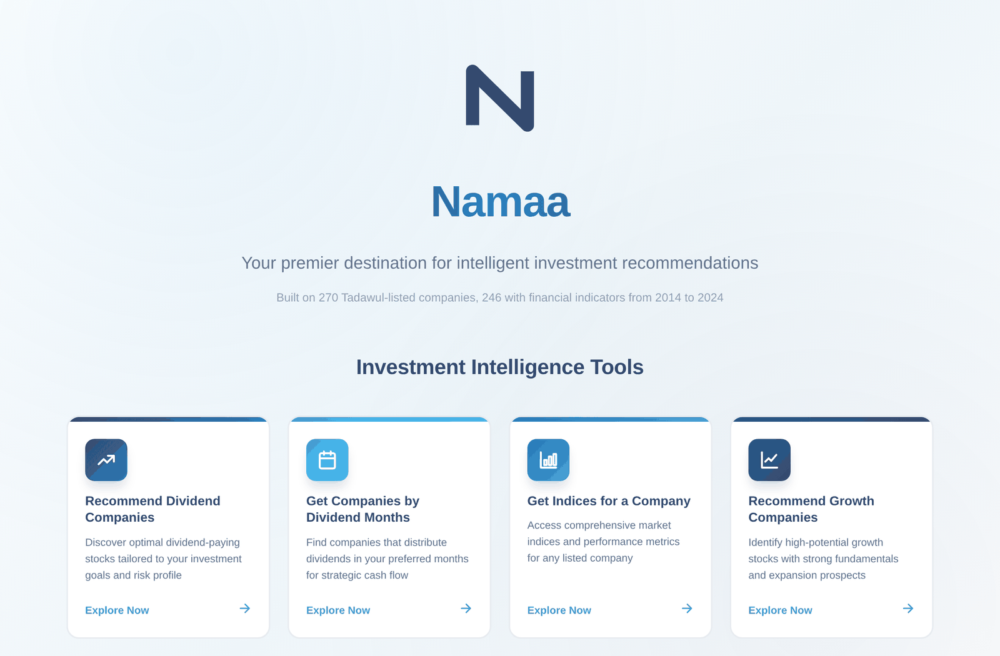
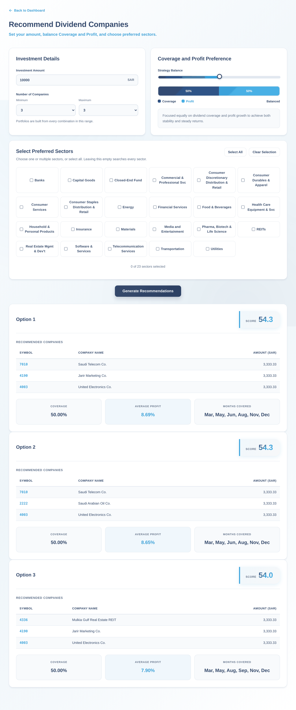
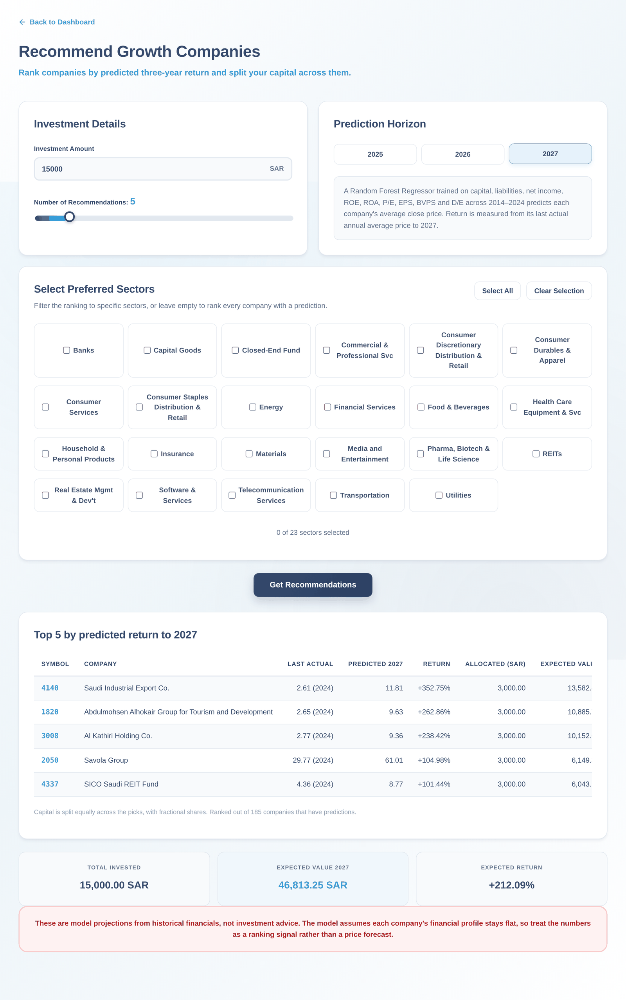

# Namaa

Four decision tools for Tadawul-listed companies: which dividend payers to hold, when they pay, what their fundamentals look like, and which companies a model ranks highest for growth.

  

**[Open the live app →](https://omaralthunaiyan-cloud.github.io/namaa-investment-tools/)** — no install, no account, nothing sent anywhere. It's a static page with the real data baked in; everything runs in your browser.

Namaa started as an IS499 senior project — PostgreSQL, a pile of Python scripts, a Streamlit page, and a separate Next.js prototype that talked to a Flask API. This repository is that work rebuilt to run as a single page: the actual database dump, extracted and compressed into the page itself, with the four tools' logic ported faithfully from the original scripts.

<p align="center">
  
</p>

---

## Contents

- [Screenshots](#screenshots)
- [Status](#status)
- [The four tools](#the-four-tools)
- [How it's built](#how-its-built)
- [Data](#data)
- [Issues found in the original scripts, and how the port fixes them](#issues-found-in-the-original-scripts-and-how-the-port-fixes-them)
- [Reproducing the build](#reproducing-the-build)
- [Layout](#layout)
- [Not investment advice](#not-investment-advice)

---

## Screenshots

A dashboard hands off to four full-page tools, each with a "Back to Dashboard" link — no tabs, no client-side framework, just plain sections shown and hidden by a few lines of JavaScript.

<table>
<tr>
<td width="50%"></td>
<td width="50%"></td>
</tr>
<tr>
<td align="center"><sub>Recommend Dividend Companies — three scored portfolios</sub></td>
<td align="center"><sub>Recommend Growth Companies — model ranking + allocation</sub></td>
</tr>
</table>

---

## Status

The app is real and live at the link above, built from the actual `Namaa_backup.dump` — not sample data. What's simplified versus the original plan:

| Piece | State |
|---|---|
| The four tools, running against real data | **live**, [try it](https://omaralthunaiyan-cloud.github.io/namaa-investment-tools/) |
| `data/*.csv` — extracted from the real database dump | **in this repo** |
| Random Forest model, retrained on the real data | **trained** — see [Data](#data) for the numbers this run produced |
| `web/index.html` + `web/data.js` | **built** — plain HTML/CSS/JS, no framework, no build step to view it |
| `tools/extract_dump.py`, `tools/train_model.py`, `tools/build_payload.py` | **working**, reproduce the whole pipeline from the dump |
| GitHub Pages deploy on push to `main` | **working**, [`.github/workflows/pages.yml`](.github/workflows/pages.yml) |
| A duplicate Python `engine/` package + `tests/test_parity.py` cross-checking it against the JS | **not built** — the logic exists once, in `web/index.html`'s JavaScript; nothing currently checks it against a second implementation |
| A bundled single-file build (esbuild, React) | **not built** — the page is two static files (`index.html`, `data.js`) instead of one bundled file; still zero external requests, still opens with no install |

If you're reading this from a job application or a portfolio link: the four tools work, against the real data, right now. The simplifications above are honest trade-offs made to ship something working rather than something theoretical — not gaps anyone is hiding.

---

## The four tools

### Recommend Dividend Companies

You give it an amount, a split between *coverage* and *profit*, and optionally some sectors. It returns three portfolios.

Profit is trailing dividend over reference close price. Coverage is how many distinct months of the year the portfolio pays in — a portfolio's coverage is the union of its members' payout months, so two companies that both pay only in March cover one month between them, while two that pay in March and September cover two.

Coverage is scored on *closeness to a target*, not on maximisation. Asking for 50% coverage means "about six months," and a portfolio covering nine months scores worse than one covering six.

Search is not exhaustive. All 128 payers would give C(128,5) ≈ 264 million combinations, so it shortlists the 25 best by `yield + 10 × months_covered` and enumerates within those — the same heuristic the original scripts used, kept exactly: changing it would change the answers.

### Get Companies by Dividend Months

Stricter than it looks. Asking for March returns companies whose *entire* 2024 was March, not everything that paid in March at some point. Asking for March and September returns companies whose year was exactly those two months. If nothing matches an exact combination, it falls back to the strongest single-month payer for each month separately, and says so.

### Get Indices for a Company

Nine annual fundamentals — capital, total liabilities, net income, ROE, ROA, EPS, P/E, BVPS, D/E — for 246 companies across 2014–2024. Search by symbol or by partial name.

The source table is gap-filled, so a company with two reporting years still shows eleven rows and the gaps carry the nearest known values forward. A repeated row means "no new filing," not "no change in the business."

### Recommend Growth Companies

A Random Forest predicts each company's average annual close price for 2025–2027 from its most recent fundamentals. Companies are ranked by projected return to 2027, and capital is split equally across the top of that ranking.

Read the model card in the app (or [Data](#data) below) before trusting a number from this one. Held-out R² is around 0.85, but the projections are built by taking each company's latest financials and only changing the year — it's a ranking signal about who looks cheap relative to their books today, not a forecast.

---

## How it's built

```
Namaa_backup.dump  (PostgreSQL 17, custom format)
        │  tools/extract_dump.py   (pgdumplib — pg_restore <17 rejects this dump)
        ▼
    data/*.csv
        │  tools/train_model.py  →  data/predicted_prices_rf.csv, data/last_actual_prices.csv
        │  tools/build_payload.py
        ▼
    web/data.js   (~110 KB — real data, compressed)
        │
    web/index.html   (plain HTML/CSS/JS, reads data.js, no build step)
        │  .github/workflows/pages.yml, on every push to main
        ▼
    GitHub Pages
```

Every tool's logic lives once, in `web/index.html`'s JavaScript, ported by hand from the corresponding script in [`reference/original/`](reference/original/) — see [Issues found](#issues-found-in-the-original-scripts-and-how-the-port-fixes-them) for what changed along the way. There's no server and no database at runtime: all filtering, joining, scoring and the dividend recommender's combinatorial search happen in the browser, over the data shipped in `data.js`.

**Why not the originally-planned React + esbuild single-file bundle?** That's more polish than the app currently has. Two static files (`index.html`, `data.js`) get to "opens with no install, zero external requests, real data" just as well, faster to ship and easier to read. Bundling into one file is a reasonable next step, not a requirement — see [Status](#status).

---

## Data

Everything traces back to `Namaa_backup.dump`, a PostgreSQL 17 custom-format dump. `pg_restore` before version 17 rejects it outright:

```
pg_restore: error: unsupported version (1.16) in file header
```

`tools/extract_dump.py` reads the archive directly with `pgdumplib` instead, recovering column order from the `CREATE TABLE` statements the dump carries in its pre-data section — no server, no `createdb`, no restore needed.

| Table | Rows | Shipped in `data/` | Used for |
|---|---:|---|---|
| `companies` | 270 | yes | names and sectors everywhere |
| `dividend_ttm` | 128 | yes | the payer universe and profit yield |
| `dividends` | 1,258 | yes | payout calendar, 2020–2026 (only 2024 is used, matching the original scripts) |
| `indices` | 983 | yes | raw fundamentals as filed |
| `indices_cleaned` | 2,706 | yes | fundamentals gap-filled to a full 2014–2024 grid; what the indices tool and the model both read |
| `indices_features` | 983 | yes | `indices` plus `earnings_yield` (not currently used — the model's feature set matches the original script's) |
| `yearly_prices_final` | 2,528 | yes | average close price per company-year — the model's training target |
| `prices_coverage` | 264 | yes | which date range each symbol has prices for |
| `last_close.csv` | 264 | yes | one row per symbol, its most recent close (derived — see [`tools/compute_last_close.py`](tools/compute_last_close.py)) |
| `predicted_prices_rf.csv`, `last_actual_prices.csv` | — | yes | model output from `tools/train_model.py` |
| `historical_prices` | 272,235 | **no** | source of `last_close.csv`; 9 MB and nothing else reads it at runtime — recover with `python tools/extract_dump.py Namaa_backup.dump --all` |

### Model results, this run

Random Forest, 300 trees, median imputation, seed 42, trained on `indices_cleaned` inner-joined to `yearly_prices_final` (1,903 rows, 185 companies), 80/20 split:

| Metric | Value |
|---|---|
| R² | 0.8511 |
| RMSE | 13.66 SAR |
| MAE | 7.78 SAR |

TASI prices in this set span roughly 5 to 300 SAR, so an RMSE of ~14 SAR is a rounding difference for one company and a doubling for another — R² is flattered by the wide price range. Projections for 2025–2027 take each company's *latest* fundamentals and only change the year, so they answer "what would this be worth if the books stayed exactly as they are," not "what will happen." Large projected returns in the Growth tool are usually companies whose last recorded price was low relative to what their fundamentals imply — sometimes a real mispricing, often a data-recency artefact. 185 companies get a projection, not 270: a company needs both fundamentals and a realised price for the same year to enter training.

### Known quirks in the source data

**One sector had a stray leading space.** The database's `sector` column has both `"Insurance"` and `" Insurance"` (one company, symbol 8110) — same sector, two strings. Trimmed on load.

**Three sectors have abbreviated names in the database** that don't match the longer names a picker UI might show: `Commercial & Professional Svc`, `Health Care Equipment & Svc`, `Real Estate Mgmt & Dev't`. This build's sector picker is generated straight from the stored values, so it doesn't hit the mismatch the original prototype had.

**`Unknown` and `Closed-End Fund` sectors exist beyond the original 22.** `Unknown` (2 sukuk ETFs) is excluded from the sector picker; `Closed-End Fund` (4 traded funds) is included.

**`indices_cleaned` is mostly repetition.** Gap-filled to a complete 2014–2024 grid per company, so 1,752 of its 2,706 rows repeat the year before verbatim — which is why `tools/build_payload.py` run-length encodes it (a bare year in the payload means "same values as before"), taking `web/data.js` down to ~110 KB.

---

## Issues found in the original scripts, and how the port fixes them

Found while porting `reference/original/` closely. Two of these returned empty results with no error in the original — the kind of bug that's easy to miss.

**Three sectors had UI labels the database never used** (see Data above). Fix: the sector picker is generated from the database's own values, so there's no separate label mapping to drift out of sync.

**Eleven companies had a blank sector in the loose `Companies.csv`** the original scripts read from disk. The database has them filled in. Fix: this build reads from the extracted database dump, not the loose CSVs.

**The generate button accepted an investment amount of zero**, which then divided by it downstream. Fix: the amount field is validated before running.

**`RGC.py` ranked companies on a linear regression** persisted to a `predicted_roi` table, while `model_random_forest.py`'s own docstring says the linear model scored below zero R² and was dropped. Fix: the Growth tool uses `RGC.py`'s allocation logic (equal weight, fractional shares) but feeds it Random Forest projections instead — a deliberate deviation, not a straight port.

**A hardcoded local database password** sat in `model_random_forest.py` and `RGC.py`. Redacted before publishing — see [`reference/README.md`](reference/README.md).

---

## Reproducing the build

```bash
pip install -r requirements.txt

python tools/extract_dump.py path/to/Namaa_backup.dump      # -> data/*.csv
python tools/extract_dump.py path/to/Namaa_backup.dump --all  # also historical_prices, for last_close.csv
python tools/compute_last_close.py                          # -> data/last_close.csv
python tools/train_model.py                                 # -> data/predicted_prices_rf.csv, data/last_actual_prices.csv
python tools/build_payload.py                                # -> web/data.js
```

Then open `web/index.html` in a browser, or push to `main` and let [`.github/workflows/pages.yml`](.github/workflows/pages.yml) deploy it.

---

## Layout

```
data/                 CSVs extracted from the database dump, plus model output
web/
  index.html           the app: all four tools, plain HTML/CSS/JS
  data.js               generated payload — not hand-edited
tools/
  extract_dump.py       dump -> data/*.csv
  compute_last_close.py data/historical_prices.csv -> data/last_close.csv
  train_model.py         data/*.csv -> the Random Forest + its predictions
  build_payload.py       data/*.csv -> web/data.js
docs/                  architecture rationale, data provenance, model card
  screenshots/           README images, generated from the live app
reference/original/    the untouched IS499 scripts, for provenance
.github/workflows/     GitHub Pages deploy on push to main
```

---

## Not investment advice

Every number here comes from historical filings and a model trained on 185 companies. The growth tool in particular projects prices by holding each company's financials constant and moving the year forward, which produces large returns for companies whose last recorded price was unusually low. Treat the output as a ranking signal and check anything before acting on it.
